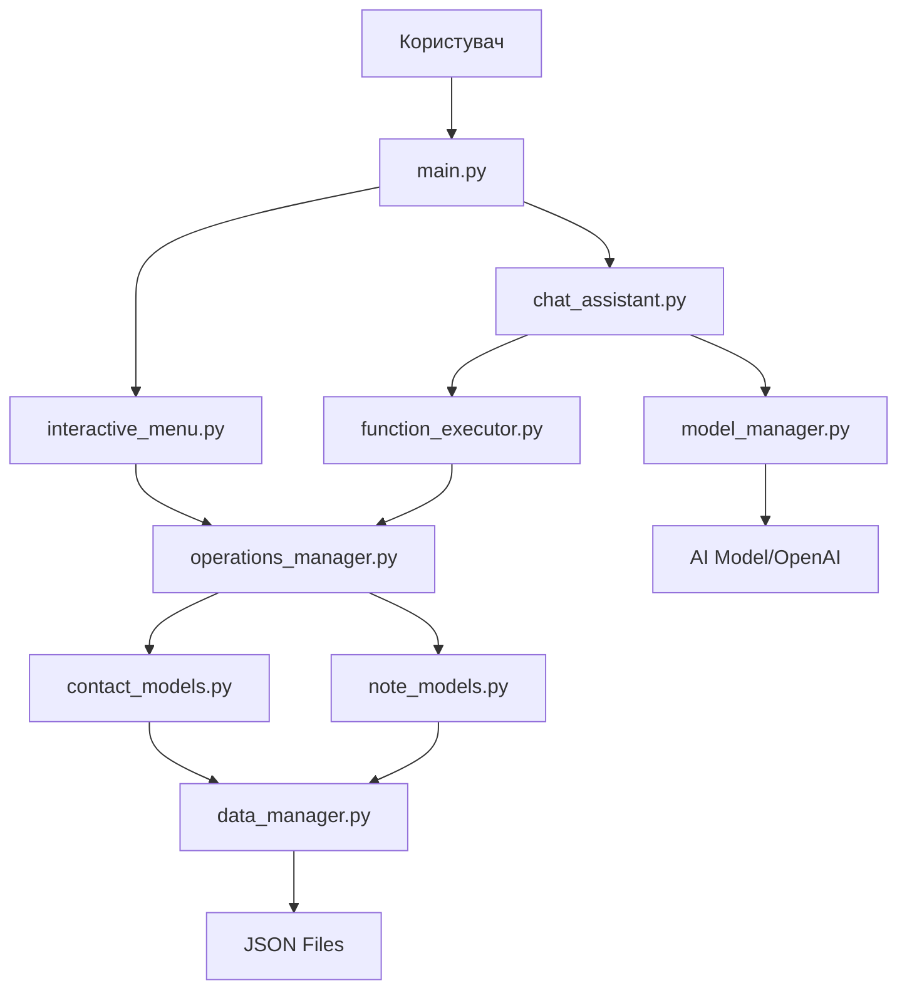

# Архітектура CLI Assistant

## Огляд

CLI Assistant - це сучасний персональний асистент з AI можливостями, побудований на модульній архітектурі. Проект використовує паттерни проектування для забезпечення гнучкості, масштабованості та простоти підтримки.

## Ключові компоненти

### 1. Рівень презентації (Presentation Layer)

#### `main.py`
- **Призначення**: Точка входу в додаток
- **Функції**: Парсинг аргументів командного рядка, запуск відповідних модулів
- **Патерни**: Command Pattern для обробки різних команд

#### `interactive_menu.py`
- **Призначення**: Інтерактивне меню з красивим інтерфейсом
- **Технології**: Rich (форматування), Questionary (інтерактивність)
- **Функції**: Навігація, форми введення, відображення результатів

#### `chat_assistant.py`
- **Призначення**: AI чат-інтерфейс
- **Функції**: Обробка природної мови, виклик функцій, історія розмов
- **Інтеграція**: З ModelManager та FunctionExecutor

### 2. Рівень бізнес-логіки (Business Logic Layer)

#### `operations_manager.py`
- **Призначення**: Уніфікований API для всіх операцій
- **Патерни**: Facade Pattern
- **Функції**: 
  - CRUD операції з контактами
  - CRUD операції з нотатками
  - Пошук та фільтрація
  - Валідація даних

#### `function_executor.py`
- **Призначення**: Виконання функцій викликаних AI
- **Патерни**: Command Pattern
- **Функції**: Парсинг параметрів, виклик операцій, форматування результатів

#### `function_definitions.py`
- **Призначення**: Визначення доступних функцій для AI
- **Функції**: Схеми параметрів, описи функцій, системні промпти

### 3. Рівень AI/ML (AI/ML Layer)

#### `model_manager.py`
- **Призначення**: Управління AI моделями
- **Патерни**: Singleton, Strategy Pattern
- **Функції**:
  - Завантаження локальних моделей
  - Інтеграція з OpenAI API
  - Генерація відповідей
  - Обробка function calling

#### `config_manager.py`
- **Призначення**: Управління конфігурацією
- **Патерни**: Singleton Pattern
- **Функції**:
  - Автоматичне визначення платформи
  - Оптимізація під залізо
  - Налаштування логування

### 4. Рівень даних (Data Layer)

#### `data_manager.py`
- **Призначення**: Збереження та завантаження даних
- **Патерни**: Repository Pattern
- **Функції**: JSON серіалізація, файлові операції, обробка помилок

#### `contact_models.py`
- **Призначення**: Моделі контактів
- **Патерни**: Value Object, Domain Model
- **Компоненти**:
  - `Field` - базовий клас полів
  - `Name`, `Phone`, `Birthday` - спеціалізовані поля
  - `Record` - контакт
  - `AddressBook` - колекція контактів

#### `note_models.py`
- **Призначення**: Моделі нотаток
- **Функції**: Управління нотатками з тегами та часовими мітками

## Патерни проектування

### 1. Singleton Pattern
- **Де**: `ModelManager`, `ConfigurationManager`
- **Чому**: Забезпечення єдиного екземпляра для всього додатку

### 2. Strategy Pattern
- **Де**: `ResponseStrategy` (OpenAI vs локальні моделі)
- **Чому**: Гнучка зміна алгоритмів генерації відповідей

### 3. Facade Pattern
- **Де**: `OperationsManager`
- **Чому**: Спрощення інтерфейсу для складних операцій

### 4. Command Pattern
- **Де**: `FunctionExecutor`
- **Чому**: Інкапсуляція запитів як об'єкти

### 5. Repository Pattern
- **Де**: `DataManager`
- **Чому**: Абстракція доступу до даних

## Потік даних



## Конфігурація та налаштування

### Змінні оточення
- `USE_OPENAI`: Використовувати OpenAI API замість локальної моделі
- `OPENAI_API_KEY`: API ключ для OpenAI
- `OPENAI_MODEL`: Модель OpenAI (за замовчуванням gpt-3.5-turbo)

### Автоматичне визначення платформи
Система автоматично визначає оптимальну конфігурацію:
- **CUDA**: Windows/Linux з NVIDIA GPU
- **MPS**: macOS з Apple Silicon
- **CPU**: Резервний варіант

## Тестування

### Структура тестів
```
tests/
├── test_personal_assistant.py     # Основні тести
├── test_data_manager.py          # Тести управління даними
├── test_models.py                # Тести моделей
└── test_*.py                     # Інші тести
```

### Підходи до тестування
- **Unit Tests**: Тестування окремих компонентів
- **Integration Tests**: Тестування взаємодії компонентів
- **Mock Objects**: Для ізоляції зовнішніх залежностей

## Розширення системи

### Додавання нових функцій
1. Визначити функцію в `function_definitions.py`
2. Реалізувати логіку в `operations_manager.py`
3. Додати тести

### Додавання нових AI моделей
1. Створити нову стратегію в `model_manager.py`
2. Реалізувати `ResponseStrategy` інтерфейс
3. Додати конфігурацію в `config_manager.py`

### Додавання нових типів даних
1. Створити модель в `database/`
2. Розширити `data_manager.py`
3. Додати операції в `operations_manager.py`

## Безпека та обробка помилок

### Валідація даних
- Валідація на рівні моделей (поля контактів)
- Валідація параметрів функцій
- Перевірка типів з TypedDict

### Обробка помилок
- Логування помилок
- Graceful degradation
- Інформативні повідомлення користувачу

### Безпека
- Валідація введених даних
- Обмеження доступу до файлів
- Безпечна серіалізація JSON
