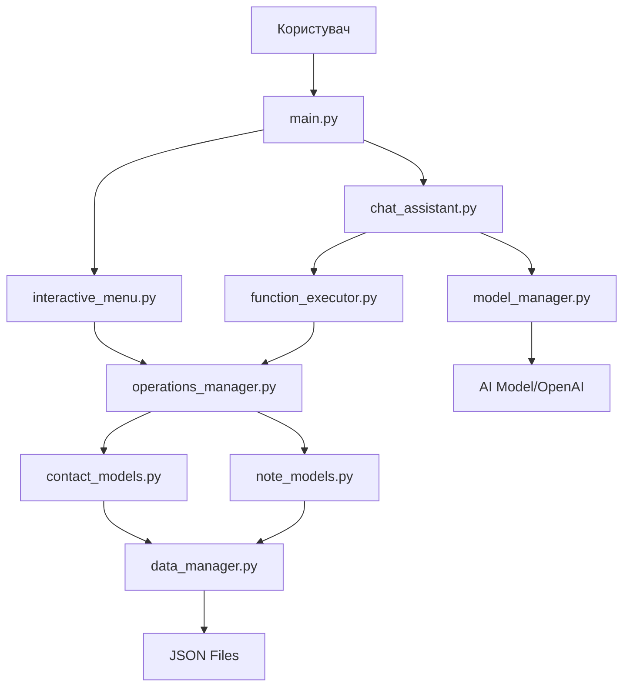
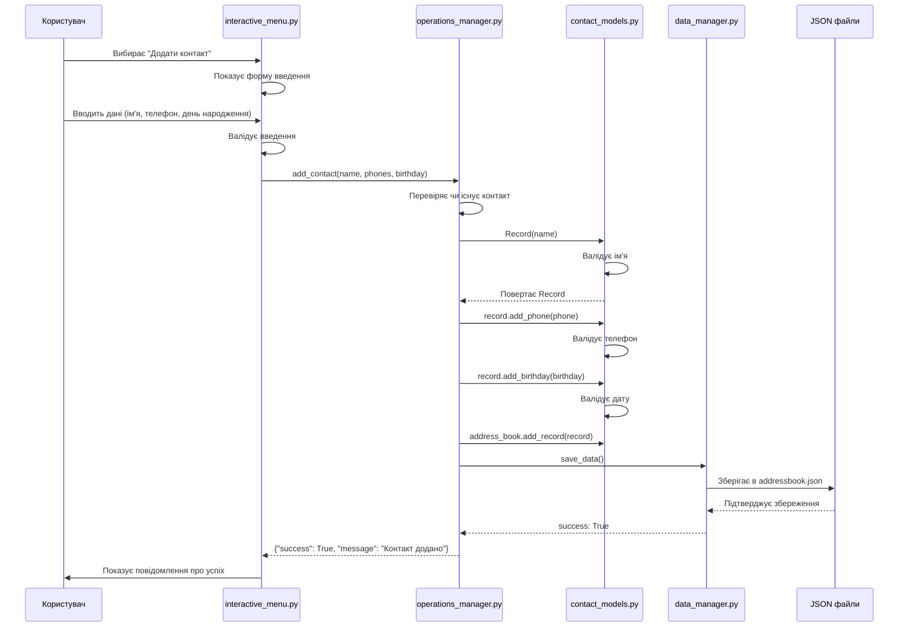
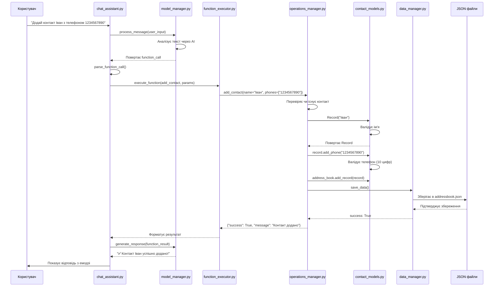
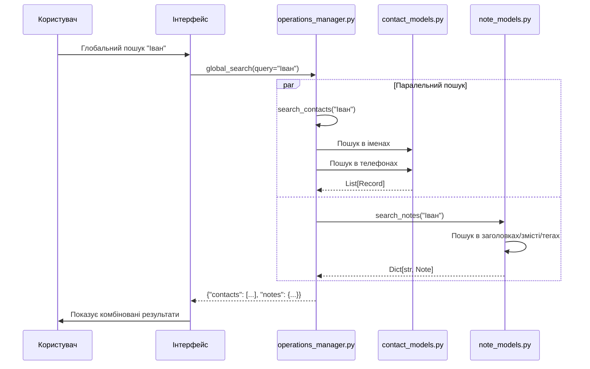

# Архітектура CLI Assistant

## Огляд

CLI Assistant - це сучасний персональний асистент з AI можливостями, побудований на модульній архітектурі. Проект використовує паттерни проектування для забезпечення гнучкості, масштабованості та простоти підтримки.

## Ключові компоненти

### 1. Рівень презентації (Presentation Layer)

#### `main.py`
- **Призначення**: Точка входу в додаток
- **Функції**: Парсинг аргументів командного рядка, запуск відповідних модулів
- **Патерни**: Command Pattern для обробки різних команд

#### `interactive_menu.py`
- **Призначення**: Інтерактивне меню з красивим інтерфейсом
- **Технології**: Rich (форматування), Questionary (інтерактивність)
- **Функції**: Навігація, форми введення, відображення результатів

#### `chat_assistant.py`
- **Призначення**: AI чат-інтерфейс
- **Функції**: Обробка природної мови, виклик функцій, історія розмов
- **Інтеграція**: З ModelManager та FunctionExecutor

### 2. Рівень бізнес-логіки (Business Logic Layer)

#### `operations_manager.py`
- **Призначення**: Уніфікований API для всіх операцій
- **Патерни**: Facade Pattern
- **Функції**: 
  - CRUD операції з контактами
  - CRUD операції з нотатками
  - Пошук та фільтрація
  - Валідація даних

#### `function_executor.py`
- **Призначення**: Виконання функцій викликаних AI
- **Патерни**: Command Pattern
- **Функції**: Парсинг параметрів, виклик операцій, форматування результатів

#### `function_definitions.py`
- **Призначення**: Визначення доступних функцій для AI
- **Функції**: Схеми параметрів, описи функцій, системні промпти

### 3. Рівень AI/ML (AI/ML Layer)

#### `model_manager.py`
- **Призначення**: Управління AI моделями
- **Патерни**: Singleton, Strategy Pattern
- **Функції**:
  - Завантаження локальних моделей
  - Інтеграція з OpenAI API
  - Генерація відповідей
  - Обробка function calling

#### `config_manager.py`
- **Призначення**: Управління конфігурацією
- **Патерни**: Singleton Pattern
- **Функції**:
  - Автоматичне визначення платформи
  - Оптимізація під залізо
  - Налаштування логування

### 4. Рівень даних (Data Layer)

#### `data_manager.py`
- **Призначення**: Збереження та завантаження даних
- **Патерни**: Repository Pattern
- **Функції**: JSON серіалізація, файлові операції, обробка помилок

#### `contact_models.py`
- **Призначення**: Моделі контактів
- **Патерни**: Value Object, Domain Model
- **Компоненти**:
  - `Field` - базовий клас полів
  - `Name`, `Phone`, `Birthday` - спеціалізовані поля
  - `Record` - контакт
  - `AddressBook` - колекція контактів

#### `note_models.py`
- **Призначення**: Моделі нотаток
- **Функції**: Управління нотатками з тегами та часовими мітками

## Патерни проектування

### 1. Singleton Pattern
- **Де**: `ModelManager`, `ConfigurationManager`
- **Чому**: Забезпечення єдиного екземпляра для всього додатку

### 2. Strategy Pattern
- **Де**: `ResponseStrategy` (OpenAI vs локальні моделі)
- **Чому**: Гнучка зміна алгоритмів генерації відповідей

### 3. Facade Pattern
- **Де**: `OperationsManager`
- **Чому**: Спрощення інтерфейсу для складних операцій

### 4. Command Pattern
- **Де**: `FunctionExecutor`
- **Чому**: Інкапсуляція запитів як об'єкти

### 5. Repository Pattern
- **Де**: `DataManager`
- **Чому**: Абстракція доступу до даних

## Потік даних

Система побудована на модульній архітектурі з чітким розділенням обов'язків. Нижче наведені детальні схеми основних потоків даних.

### 1. Загальна схема архітектури



### 2. Додавання контакту через інтерактивне меню



### 3. Додавання контакту через AI асистента



### 4. Пошук нотаток

```mermaid
sequenceDiagram
    participant User as Користувач
    participant Interface as Інтерфейс (Menu/Chat)
    participant OpsMgr as operations_manager.py
    participant NoteMgr as note_models.py
    participant Note as Note об'єкти

    User->>Interface: Запит на пошук нотаток
    Interface->>OpsMgr: search_notes(query="програмування")
    OpsMgr->>NoteMgr: search_notes(query)
    NoteMgr->>NoteMgr: Перетворює query в нижній регістр
    
    loop Для кожної нотатки
        NoteMgr->>Note: search_in_content(query)
        Note->>Note: Перевіряє заголовок
        Note->>Note: Перевіряє зміст
        Note->>Note: Перевіряє теги
        Note-->>NoteMgr: True/False
        alt Якщо знайдено збіг
            NoteMgr->>NoteMgr: Додає до результатів
        end
    end
    
    NoteMgr-->>OpsMgr: Dict[str, Note] результати
    OpsMgr-->>Interface: Повертає знайдені нотатки
    Interface->>User: Показує результати пошуку
```

### 5. Глобальний пошук



## Детальний опис потоків

### Додавання контакту через меню

**Крок 1: Взаємодія з користувачем**
- Користувач запускає `main.py` без параметрів
- Система завантажує інтерактивне меню з бібліотекою Rich
- Користувач вибирає опцію "Додати контакт"
- Система показує форму з полями: ім'я (обов'язкове), телефони, день народження

**Крок 2: Валідація на рівні інтерфейсу**
- `interactive_menu.py` перевіряє що ім'я не пусте
- Попередньо валідує формат телефону та дати
- Якщо дані некоректні, показує помилку та просить повторити

**Крок 3: Передача до бізнес-логіки**
- Меню викликає `operations_manager.add_contact()`
- `OperationsManager` служить Facade для всіх операцій
- Метод приймає параметри: name, phones (список), birthday (опціонально)

**Крок 4: Створення об'єкта контакту**
- `OperationsManager` перевіряє чи існує контакт з таким ім'ям
- Створює новий `Record` об'єкт через `contact_models.py`
- Конструктор `Record` створює `Name` об'єкт з валідацією

**Крок 5: Додавання додаткових полів**
- Для кожного телефону викликається `record.add_phone()`
- Створюється `Phone` об'єкт з валідацією (рівно 10 цифр)
- Якщо вказано день народження, створюється `Birthday` об'єкт

**Крок 6: Збереження даних**
- Готовий Record додається до AddressBook
- Викликається `data_manager.save_data()`
- Дані серіалізуються в JSON та зберігаються в файл

### Додавання контакту через AI асистента

**Крок 1: Обробка природної мови**
- Користувач вводить текст типу "Додай контакт Іван з телефоном 1234567890"
- `chat_assistant.py` передає текст до `model_manager.py`
- AI модель (локальна або OpenAI) аналізує текст та розпізнає намір

**Крок 2: Генерація виклику функції**
- Модель повертає структуру function_call з функцією `add_contact`
- `chat_assistant.py` парсить відповідь через `parse_function_call()`
- Витягуються параметри: name="Іван", phones=["1234567890"]

**Крок 3: Виконання функції**
- `function_executor.py` отримує виклик функції
- Валідує параметри згідно схеми з `function_definitions.py`
- Викликає відповідний метод в `operations_manager.py`

**Крок 4-6: Аналогічно з меню**
- Далі процес ідентичний додаванню через меню
- Створюється Record, валідуються дані, зберігаються в файл

**Крок 7: Генерація відповіді**
- Результат операції повертається до `chat_assistant.py`
- AI генерує дружню відповідь з емодзі
- Користувач бачить повідомлення типу "✅ Контакт Іван успішно додано!"

### Пошук нотаток

**Крок 1: Прийом запиту**
- Користувач вводить пошуковий запит (через меню або чат)
- Система викликає `operations_manager.search_notes(query)`

**Крок 2: Обробка запиту**
- `OperationsManager` передає запит до `NotesManager`
- Запит конвертується в нижній регістр для нечутливого пошуку

**Крок 3: Перебір нотаток**
- Система проходить через всі нотатки в `notes_manager.data`
- Для кожної нотатки викликається `note.search_in_content(query)`

**Крок 4: Пошук в полях**
- Метод `search_in_content` перевіряє:
  - Заголовок нотатки (часткове співпадіння)
  - Зміст нотатки (часткове співпадіння)  
  - Всі теги нотатки (часткове співпадіння)

**Крок 5: Формування результатів**
- Нотатки зі співпадіннями додаються до словника результатів
- Повертається Dict[str, Note] де ключ - ID нотатки

**Крок 6: Відображення**
- Результати передаються назад до інтерфейсу
- Система показує список знайдених нотаток з підсвічуванням

### Ключові особливості архітектури

1. **Розділення обов'язків**: Кожен модуль має чітко визначену роль
2. **Валідація на кількох рівнях**: Інтерфейс → Бізнес-логіка → Модель даних
3. **Централізоване управління**: OperationsManager як єдина точка входу
4. **Гнучкість інтерфейсів**: Однакова бізнес-логіка для меню та AI
5. **Автоматичне збереження**: Кожна операція автоматично зберігає зміни

## Конфігурація та налаштування

### Змінні оточення
- `USE_OPENAI`: Використовувати OpenAI API замість локальної моделі
- `OPENAI_API_KEY`: API ключ для OpenAI
- `OPENAI_MODEL`: Модель OpenAI (за замовчуванням gpt-3.5-turbo)

### Автоматичне визначення платформи
Система автоматично визначає оптимальну конфігурацію:
- **CUDA**: Windows/Linux з NVIDIA GPU
- **MPS**: macOS з Apple Silicon
- **CPU**: Резервний варіант

## Тестування

### Структура тестів
```
tests/
├── test_personal_assistant.py     # Основні тести
├── test_data_manager.py          # Тести управління даними
├── test_models.py                # Тести моделей
└── test_*.py                     # Інші тести
```

### Підходи до тестування
- **Unit Tests**: Тестування окремих компонентів
- **Integration Tests**: Тестування взаємодії компонентів
- **Mock Objects**: Для ізоляції зовнішніх залежностей

## Розширення системи

### Додавання нових функцій
1. Визначити функцію в `function_definitions.py`
2. Реалізувати логіку в `operations_manager.py`
3. Додати тести

### Додавання нових AI моделей
1. Створити нову стратегію в `model_manager.py`
2. Реалізувати `ResponseStrategy` інтерфейс
3. Додати конфігурацію в `config_manager.py`

### Додавання нових типів даних
1. Створити модель в `database/`
2. Розширити `data_manager.py`
3. Додати операції в `operations_manager.py`

## Безпека та обробка помилок

### Валідація даних
- Валідація на рівні моделей (поля контактів)
- Валідація параметрів функцій
- Перевірка типів з TypedDict

### Обробка помилок
- Логування помилок
- Graceful degradation
- Інформативні повідомлення користувачу

### Безпека
- Валідація введених даних
- Обмеження доступу до файлів
- Безпечна серіалізація JSON

## Структура проекту

```
cli-assistant/
├── src/
│   ├── cli_assistant/                    # Основний пакет асистента
│   │   ├── __init__.py                   # Ініціалізація пакета
│   │   ├── main.py                       # Точка входу, парсинг аргументів
│   │   ├── interactive_menu.py           # Інтерактивне меню (Rich + Questionary)
│   │   ├── chat_assistant.py             # AI чат-інтерфейс
│   │   ├── operations_manager.py         # Facade для всіх операцій
│   │   ├── function_executor.py          # Виконання функцій від AI
│   │   ├── function_definitions.py       # Схеми функцій для AI
│   │   ├── model_manager.py              # Управління AI моделями
│   │   └── config_manager.py             # Конфігурація та логування
│   ├── database/                         # Модуль даних
│   │   ├── __init__.py                   # Ініціалізація пакета
│   │   ├── contact_models.py             # Моделі контактів
│   │   ├── note_models.py                # Моделі нотаток
│   │   └── data_manager.py               # Збереження/завантаження даних
│   └── personal_assistant.py             # Legacy API (для сумісності)
├── tests/                                # Тести
│   ├── __init__.py                       # Ініціалізація тестів
│   ├── test_models.py                    # Тести моделей даних
│   ├── test_data_manager.py              # Тести управління даними
│   ├── test_personal_assistant.py        # Тести основного функціоналу
│   └── test_*.py                         # Інші тести
├── models/                               # Локальні AI моделі
│   └── mistral/                          # Mistral модель
├── pyproject.toml                        # Конфігурація Poetry
├── README.md                             # Документація користувача
├── ARCHITECTURE.md                       # Архітектурна документація
└── addressbook.json                      # Файл з контактами
```

## Швидкий старт для розробників

### 1. Розуміння потоку даних
Почніть з вивчення `operations_manager.py` - це центральний компонент який об'єднує всі операції.

### 2. Додавання нової функції
```python
# 1. Додати в function_definitions.py
"new_function": {
    "description": "Опис функції",
    "parameters": {
        "type": "object",
        "properties": {
            "param1": {"type": "string", "description": "Параметр 1"}
        },
        "required": ["param1"]
    }
}

# 2. Реалізувати в operations_manager.py
def new_function(self, param1: str) -> Dict[str, Any]:
    try:
        # Логіка функції
        return {"success": True, "message": "Успішно виконано"}
    except Exception as e:
        return {"success": False, "message": str(e)}

# 3. Додати тест
def test_new_function():
    ops = OperationsManager()
    result = ops.new_function("test")
    assert result["success"] == True
```

### 3. Розширення AI можливостей
- Додати нову модель в `model_manager.py`
- Реалізувати `ResponseStrategy` інтерфейс
- Оновити конфігурацію в `config_manager.py`

### 4. Debugging
- Увімкнути детальне логування в `config_manager.py`
- Використати `rich.print()` для красивого виводу
- Перевірити файли `addressbook.json` та `addressbook_notes.json`

## Приклади використання

### Програмний доступ
```python
from cli_assistant.operations_manager import OperationsManager

ops = OperationsManager()

# Додати контакт
result = ops.add_contact("Іван", ["1234567890"], "01.01.1990")
print(result)  # {"success": True, "message": "Contact added"}

# Пошук контактів
contacts = ops.search_contacts("Іван")
print(f"Знайдено {len(contacts)} контактів")

# Додати нотатку
note_result = ops.add_note("Ідея", "Створити додаток", ["програмування"])
print(note_result)  # {"success": True, "note_id": "note_0001"}
```

### Командний рядок
```bash
# Запуск інтерактивного меню
python -m cli_assistant

# Запуск AI чату
python -m cli_assistant --chat

# Запуск з OpenAI
USE_OPENAI=true OPENAI_API_KEY=your_key python -m cli_assistant --chat
```

Ця архітектура забезпечує:
- 🔄 **Модульність**: Легко додавати нові функції
- 🛡️ **Надійність**: Валідація на кількох рівнях
- 🎯 **Гнучкість**: Підтримка різних інтерфейсів
- 📈 **Масштабованість**: Простота розширення
- 🧪 **Тестованість**: Повне покриття тестами
